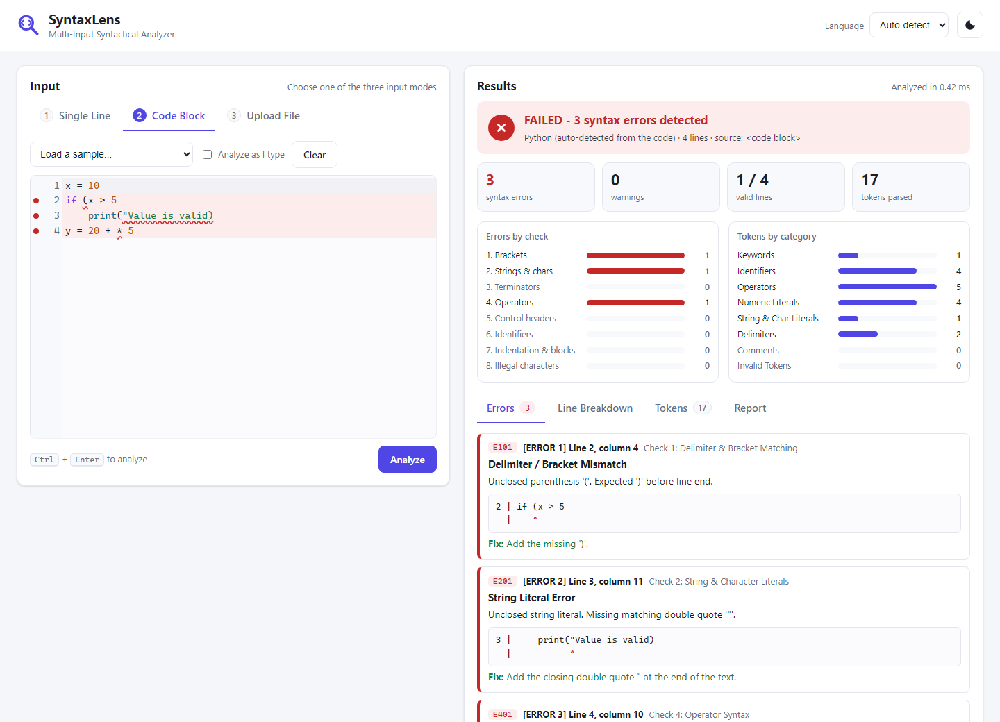

# SyntaxLens — Multi-Input Syntactical Analyzer

[](https://github.com/codrei/Multi-Input-Syntactical-Analyzer-Application-Project-in-Programming-Language/actions/workflows/ci.yml)

SyntaxLens checks source code for syntax errors without running it. Code can be
given three ways: a single line, a multi-line block, or a file. SyntaxLens
splits the code into tokens and checks them against syntax rules. It then
produces a report that either confirms the code is valid or lists each error
with its line number, category and explanation.

Languages: **Python** and **Java**, followed by C, C++, C# and JavaScript.

> **Status: Phases 1, 2, 4 and 5 of 8 complete.** All eight syntax checks work
> for Python and Java, and both example reports from the project specification
> are reproduced exactly. SyntaxLens has a **web app** and a **command line**,
> each supporting all three input modes. Next: more languages and a no-install
> Windows build. See the [progress checklist](#progress) and the full
> [project plan](docs/PLAN.md).



## The web app

The web app has a tab for each input mode: **Single Line**, **Code Block** (an
editor with line numbers and syntax colors) and **Upload File** (drag and drop
or browse). After analysis it shows:

- a PASSED / FAILED banner, counts, and bar charts of errors per check and
  tokens per category;
- the errors marked inside the code: a red line, a dot in the margin and a
  wavy underline under the exact token;
- result tabs: **Errors** (each with a pointer to the column and a fix),
  **Line Breakdown**, **Tokens** (filterable by category) and **Report** (the
  detailed or classic text report, with Copy and Download .txt / .json).

It also has a Samples menu, an "Analyze as I type" option, a dark theme, and
links that open a sample directly, such as `/#sample=spec_example_2`.

To run it on your own computer, without internet:

```bat
py -m syntaxlens web
```

This opens the app in your browser at `http://127.0.0.1:8000`. The page runs
on your computer only. It uses no internet connection and installs nothing:
the server is Python's built-in WSGI server, and the code editor
([CodeMirror 5](https://codemirror.net/5/), MIT license) is stored in the
repository.

### Online on Vercel

The same app runs on [Vercel](https://vercel.com). [`app.py`](app.py) gives
Vercel the app, and [`vercel.json`](vercel.json) sends every request to it.
Nothing needs to be installed, because SyntaxLens uses only the standard
library. To deploy:

1. On vercel.com choose **Add New → Project**, and import this GitHub repository.
2. Keep the default settings and press **Deploy**.

After that, every push to `main` updates the site automatically.

## The command line

You need Python 3.10 or newer. On Windows, install it from
[python.org](https://www.python.org/downloads/); the installer adds the `py`
command. SyntaxLens needs no other packages.

```bat
git clone https://github.com/codrei/Multi-Input-Syntactical-Analyzer-Application-Project-in-Programming-Language.git syntaxlens
cd syntaxlens
py -m syntaxlens file samples\spec_example_2.py
```

On macOS or Linux, use `python3` instead of `py` and `/` instead of `\`.

The easiest way in is the interactive menu: run `py -m syntaxlens` and choose
1, 2 or 3. Each input mode also has its own command:

| Input mode | Command |
|---|---|
| 1. Single line | `py -m syntaxlens line "x = 10"` |
| 2. Code block | `py -m syntaxlens block`, then type or paste the code and finish with a line containing only `.` |
| 3. File | `py -m syntaxlens file samples\HelloWorld.java` (several files at once are allowed) |

Options:

| Option | Effect |
|---|---|
| `--style detailed` | the default: error codes, a pointer to the exact column, a suggested fix, a line-by-line breakdown, and totals for each of the 8 checks and 8 token categories |
| `--style classic` | exactly the layout of the specification's example reports |
| `--format json` | the full result as JSON data, including every token |
| `--output FILE` | save the report to a file instead of printing it |
| `--lang python` / `--lang java` | choose the language instead of detecting it |
| `--no-color` | plain text; colors are otherwise used in a terminal, and never in saved files |

The language is detected automatically: from the file extension, or for typed
code, from features typical of each language. The exit code is 0 when the code
is valid, 1 when syntax errors were found, and 2 when the input could not be
read.

### Example: the specification's Example 2 (classic style)

```
============================================================
                SYNTACTICAL ANALYSIS REPORT
============================================================
Status: FAILED (3 Syntax Errors Detected)
Total Lines Analyzed: 4
Target Syntax Rule: Python (auto-detected from the .py extension)

SYNTAX ERROR DETAILS:
------------------------------------------------------------
[ERROR 1] Line 2: if (x > 5
  - Category: Delimiter / Bracket Mismatch
  - Details: Unclosed parenthesis '('. Expected ')' before line end.

[ERROR 2] Line 3: print("Value is valid)
  - Category: String Literal Error
  - Details: Unclosed string literal. Missing matching double quote '"'.

[ERROR 3] Line 4: y = 20 + * 5
  - Category: Invalid Operator Sequence
  - Details: Consecutive binary operators '+ *' without an operand in between.

------------------------------------------------------------
SUMMARY:
  - Total Lines Checked: 4
  - Valid Lines: 1
  - Flagged Lines: 3 (Lines 2, 3, 4)
  - Action Required: Correct highlighted syntax errors above.
============================================================
```

This is the specification's expected report, word for word, plus a line naming
the detected language. Producing exactly these three errors is harder than it
looks:

- Python's own parser stops at the first error, so it reports only one of them.
- A naive line-by-line checker reports about six: line 2 also lacks its `:`,
  and on line 3 the open string swallows the `)`.

SyntaxLens reports only the root cause on each line (see
[error recovery](#error-recovery)). Example 1 from the specification is also
reproduced exactly, including its line-by-line breakdown and "Total Tokens
Parsed: 14".

The default **detailed** style adds, for each error, its code, the check that
found it, a pointer to the column and a fix:

```
[ERROR 3] Line 4: y = 20 + * 5
  - Category: Invalid Operator Sequence
  - Details: Consecutive binary operators '+ *' without an operand in between.
  - Location: line 4, column 10 (check 4: Operator Syntax, code E401)
      4 | y = 20 + * 5
        |          ^
  - Fix: Remove one of the operators, or put a value between them.
```

It also adds a line-by-line breakdown in which each flagged line points to its
error, and totals per category, as the specification requires ("detailed lists
of identified items and summary totals for each category"):

```
ERRORS BY CATEGORY (the 8 syntax checks):
  1. Delimiter & Bracket Matching ..............   1
  2. String & Character Literals ...............   1
  3. Statement Terminators .....................   0
  4. Operator Syntax ...........................   1
  5. Control Structure Headers .................   0
  6. Identifier Naming .........................   0
  7. Indentation & Block Structure .............   0
  8. Illegal Characters & Malformed Literals ...   0
  Total ........................................   3  (0 warnings)

TOKENS BY CATEGORY (the 8 token categories):
  Keywords ...............   1  if
  Identifiers ............   4  x (x2), print, y
  Operators ..............   5  = (x2), >, +, *
  Numeric Literals .......   4  10, 5 (x2), 20
  String & Char Literals .   1  "Value is valid)
  Delimiters .............   2  ( (x2)
  Comments ...............   0
  Invalid Tokens .........   0
  Total Tokens Parsed ....  17
```

Java works the same way:

```
> py -m syntaxlens line "int total = 5 + * 2"
...
[ERROR 1] Line 1: int total = 5 + * 2
  - Category: Invalid Operator Sequence
  - Details: Consecutive binary operators '+ *' without an operand in between.

[ERROR 2] Line 1: int total = 5 + * 2
  - Category: Missing Semicolon
  - Details: Missing semicolon ';' at the end of the statement.
```

`py -m syntaxlens tokens FILE` shows the lexer's view instead: every token
with its category, and a total for each of the eight token categories.

## The eight syntax checks

The specification asks for at least four of six checks. SyntaxLens implements
all six plus two more. Every error has a code, a category, a line and column,
and a suggested fix.

| # | Check | Examples of errors found | Codes |
|---|---|---|---|
| 1 | Delimiter & bracket matching | `if (x > 5` · `a[1)` · a stray `}` · a block never closed | E101–E103 |
| 2 | String & character literals | `print("hi)` · an unclosed `"""` · Java `'ab'` or `''` | E201–E204 |
| 3 | Statement terminators | a missing `;` in Java · a missing `:` after a Python header | E301–E302 |
| 4 | Operator syntax | `20 + * 5` · `x = 5 +` · `x = 5 6` · `5 = x` · Java `x + 1;` | E401–E408 |
| 5 | Control structure headers | `if :` · `for i range(10):` · `for (i=0, i<5, i++)` · `if x > 5 {` in Java · `else x:` | E501–E510 |
| 6 | Identifier naming | `2total = 5` · `my-var = 3` · `class = 5` · `int = 5;` | E601–E604 |
| 7 | Indentation & block structure | unexpected indent · missing indented block · `else` without `if` · `break` outside a loop | E701–E708 |
| 8 | Illegal characters & malformed literals | curly quotes “ ” pasted from Word · `3.14.15` · `0b102` · an unclosed `/*` | E801–E805 |

Warnings (codes starting with W) flag code that is valid but almost certainly a
mistake, such as `if (x = 5)` or `if (x > 5);` in Java. They do not make the
analysis fail.

Mistakes carried over from other languages get specific advice. Examples:
`a && b` in Python ("Python writes logical AND as 'and'"), `x++` in Python,
`print "hello"` ("Missing parentheses in call to 'print'"), `else if` in Python,
`elif` in Java, and a misspelled `retrun x` ("Did you mean 'return'?").

## How it works

```
 line / block / file
        │
  ① Source      decode, normalize line endings, reject blank / binary / oversized input   ✔
  ② Detect      choose the language: file extension, otherwise score the content          ✔
  ③ Lexer       one master regular expression → tokens in 8 categories                    ✔
  ④ Structurer  tokens → statements (Python: logical lines; Java: ; { })                   ✔
  ⑤ 8 Checks    independent modules; each error type belongs to exactly one check         ✔
  ⑥ Filter      keep root causes, drop follow-on errors                                   ✔
  ⑦ Report      result → text report (classic or detailed), JSON, web app, menu           ✔
```

| Stage | Technique | Module |
|---|---|---|
| Lexer | One master regular expression with a named group per token type, read in one left-to-right pass. Strings and comments are matched whole, so code inside them is never checked. | [`lexer.py`](syntaxlens/lexer.py) |
| Statements | Python statements end at the line end unless a bracket is open; Java statements end at `;`, `{` or `}`. | [`structure.py`](syntaxlens/structure.py) |
| Brackets | A stack: openers are pushed; a closer must match the top. Nesting works because the most recent opener is always on top. | [`checks/delimiters.py`](syntaxlens/checks/delimiters.py) |
| Operators | A two-state machine that expects either a value or an operator. `+5` is fine because `+` can be a sign; in `+ *`, `*` cannot be. | [`expressions.py`](syntaxlens/expressions.py) |
| Headers | A small grammar per header, e.g. `for_header = "for" targets "in" iterable ":"`. | [`checks/control.py`](syntaxlens/checks/control.py) |
| Indentation | A stack of indentation levels, the same method CPython uses. | [`checks/blocks.py`](syntaxlens/checks/blocks.py) |

All language-specific details (keywords, operators, comment markers, string and
number formats) are stored as data in [`syntaxlens/profiles/`](syntaxlens/profiles).

### Error recovery

The analyzer never stops at the first error:

1. **The lexer never stops.** An illegal character becomes an *invalid* token,
   and an unclosed string ends at the end of its line.
2. **Statements are re-synchronized at line breaks.** If a line ends with a
   complete value but a bracket or `;` is still missing, and the next line
   clearly starts a new statement, the statement ends there. The missing
   character is reported on this line, and the next line is analyzed on its own.
3. **Root causes are reported; follow-on errors are filtered.** Within one
   statement, an unclosed string or illegal character hides the bracket,
   terminator and operator errors it caused. A bracket error hides the
   terminator and operator errors after it. A header with an error still opens
   its block, so the indented line after it is not reported as well.

## Testing

```bat
py -m pip install -e ".[dev]"
py -m pytest
```

319 automated tests run on Windows and Linux with Python 3.10–3.13 on every push:

- **Specification examples:** both example reports are reproduced exactly.
- **Every check:** at least one test per error type, in Python and in Java.
- **No false alarms:** ten realistic valid programs (about 2,000 lines of Python
  and Java) must produce zero findings. Each is also confirmed valid by the real
  compiler: CPython for Python, and `javac` on the GitHub test machines for Java.
- **Lexer cross-check:** the Python lexer splits code token-for-token the same
  way as Python's own `tokenize` module.
- **Robustness:** thousands of random inputs never crash the analyzer.
- **Speed:** 10,000 lines are analyzed in about 0.3 seconds.

## Progress

- [x] **Phase 1 — Foundation:** project setup, automated testing on Windows and Linux, input loading, language detection, Python and Java lexer, 8 token categories
- [x] **Phase 2 — Syntax checks:** statement builder, the 8 checks for Python and Java, error recovery, the report in the specification's format; both specification examples reproduced
- [ ] **Phase 3 — More languages:** C, C++, C#, JavaScript; accuracy measurement
- [x] **Phase 4 — Report and CLI:** detailed report style with column pointers, fix suggestions and per-category totals; JSON export; save to file; interactive menu; colors in the Windows terminal
- [x] **Phase 5 — Web app:** three input tabs, errors marked in the code editor, result tabs with charts and counts, report download; runs offline (`py -m syntaxlens web`) and on Vercel
- [ ] **Phase 6 — Hardening:** Windows `.exe`, one-click launcher
- [ ] **Phase 7 — Documentation:** User Manual (PDF and DOCX)
- [ ] **Phase 8 — Demo:** demonstration video and defense preparation

## Repository layout

```
syntaxlens/          the analyzer
  source.py          ① input loading
  detect.py          ② language detection
  lexer.py           ③ tokenizer            (tokens.py: token kinds and the 8 categories)
  structure.py       ④ statement builder
  checks/            ⑤ the eight checks, one module each
  expressions.py       the operator/operand state machine used by check 4
  analyzer.py        ⑥ pipeline and follow-on error filter
  diagnostics.py       error model: codes, categories, severity
  report/text.py     ⑦ text reports (classic and detailed styles)
  report/json_report.py  JSON report (also used by the web app)
  profiles/            language rules stored as data (Python, Java)
  cli.py               command-line interface
  menu.py              interactive menu (run with no command)
  console.py           terminal colors
  web/app.py           web server (WSGI, standard library only)
  web/server.py        runs the web app locally: py -m syntaxlens web
  web/static/          the page: index.html, styles.css, app.js, CodeMirror editor
app.py, vercel.json    Vercel deployment
tests/               automated tests (pytest) and valid sample programs
samples/             demo inputs, including both specification examples
docs/PLAN.md         project plan and schedule
docs/images/         screenshots
```
